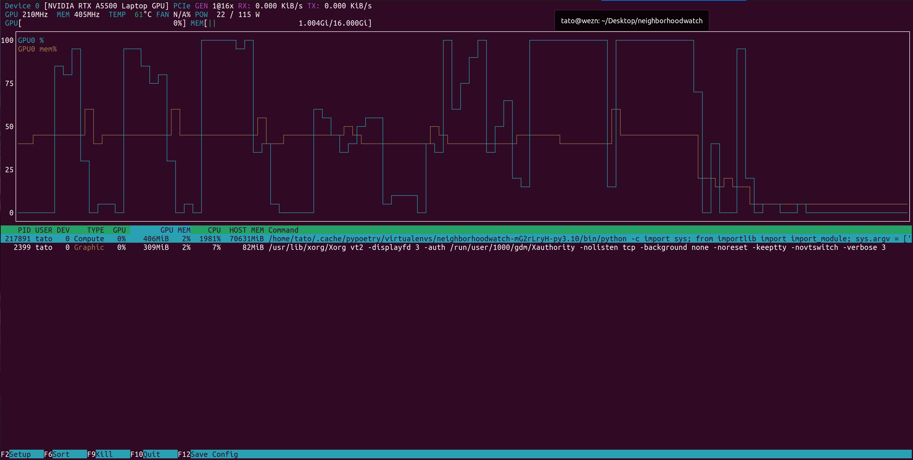

## neighborhoodwatch

GPU powered brute force knn ground truth dataset generator

### set up the environment

**NOTE**: Please refer to [install_env.sh](bash/install_env.sh) for more information about the environment setup details.
* This script has been verified on AWS `p3.8xlarge` instance type with `Ubuntun 22.04` OS

---

At high level, in order to run this program, the following prerqusites need to be satsified:
* One computing instance with Nividia GPU (e.g. AWS `p3.8xlarge` instance type)
* Nivdia CUDA toolkit and driver 12 installed ([link](https://docs.nvidia.com/cuda/cuda-installation-guide-linux/index.html))
* Nividia cuDNN library installed ([link](https://docs.nvidia.com/deeplearning/cudnn/install-guide/index.html))
* Nividia NCCL library installed ([link](https://docs.nvidia.com/deeplearning/nccl/install-guide/index.html))
* Python version 3.10
   * A python virtual environemtn (e.g. MiniConda) is highly recommended
* Poetry Python dependency management

### run the program

run nw with poetry:
```
poetry run nw 10000 100000 1536 -k 100 --enable-memory-tuning
```

or for local embeddings:
```
poetry run nw 10000 100000 384 -k 100 -m 'intfloat/multilingual-e5-small' --enable-memory-tuning
```

usage:

```
$ poetry run nw -h
usage: nw [-h] [-k K] [-m MODEL_NAME] [-d DATA_DIR] [--enable-memory-tuning] [--disable-memory-tuning] [--gen-hdf5 | --no-gen-hdf5] [--validation | --no-validation] query_count base_count dimensions

nw (neighborhood watch) uses GPU acceleration to generate ground truth KNN datasets

positional arguments:
  query_count
  base_count
  dimensions

options:
  -h, --help            show this help message and exit
  -k K, --k K
  -m MODEL_NAME, --model_name MODEL_NAME
  -d DATA_DIR, --data_dir DATA_DIR
                        Directory to store the generated data (default: knn_dataset)
  --enable-memory-tuning
                        Enable memory tuning
  --disable-memory-tuning
                        Disable memory tuning (useful for very small datasets)
  --gen-hdf5, --no-gen-hdf5
                        Generate hdf5 files (default: True) (default: True)
  --validation, --no-validation
                        Validate the generated files (default: False) (default: False)

Some example commands:

    nw 10000 10000 1024 -k 100 -m 'intfloat/e5-large-v2' --disable-memory-tuning
    nw 10000 10000 768 -k 100 -m 'textembedding-gecko' --disable-memory-tuning
    nw 10000 10000 384 -k 100 -m 'intfloat/e5-small-v2' --disable-memory-tuning
    nw 10000 10000 768 -k 100 -m 'intfloat/e5-base-v2' --disable-memory-tuning
```

### run the tests

```
poetry run pytest
```

#### cli:


#### nvtop:


